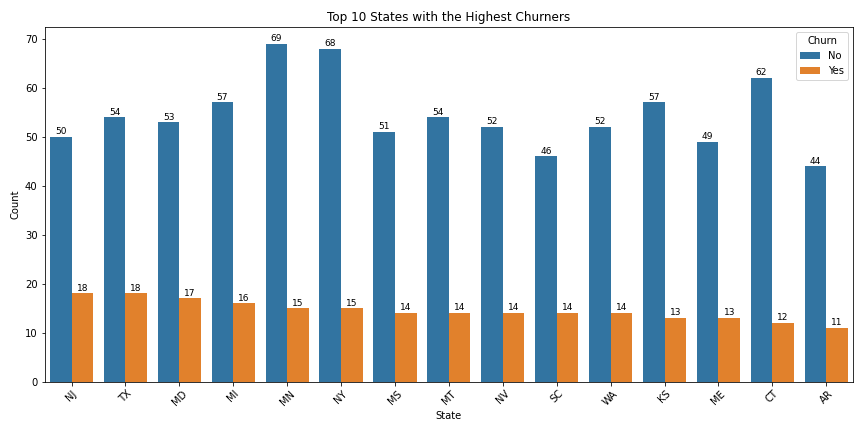
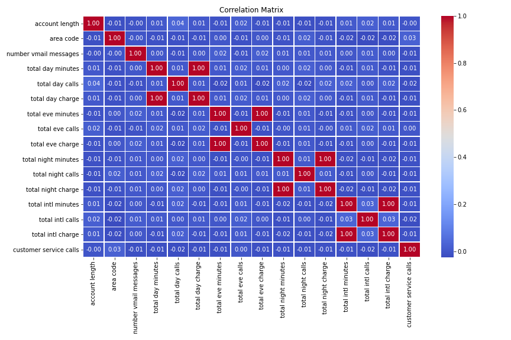

## PHASE3_PROJECT
## BUSINESS OVERVIEW
This project focuses on predicting customer churn in the telecommunications industry by analyzing customer data to identify patterns associated with attrition. By leveraging machine learning models, particularly logistic regression, the project aims to accurately forecast which customers are likely to cancel their service. The insights gained from this model enable businesses to implement targeted retention strategies, such as personalized offers and improved customer service, reducing churn and increasing customer lifetime value. Ultimately, the project helps optimize resource allocation, enhance customer retention efforts, and improve overall business decision-making, leading to higher profitability and competitive advantage.
## BUSINESS UNDERSTANDING
 In the telecommunications industry, customer churn is a critical metric that directly impacts profitability. Churn refers to the loss of customers who decide to cancel or stop using the company’s services. For telecom companies,understanding the factors that contribute to customer churn and being able to predict which customers are at risk of leaving can provide a significant competitive advantage. This project focuses on building a predictive model that helps the company identify customers likely to churn, enabling them to take proactive steps to retain these 
customers.
## BUSINESS QUESTIONS
  What are the key factors contributing to customer churn?
  Which customer segments are most at risk of churn?
  How can customer retention be improved?
  What impact does churn have on the company’s revenue and growth?
  What is the effectiveness of current customer retention strategies?
  Which states or regions exhibit the highest churn rates, and why?
  Can predictive models help anticipate churn and reduce it proactively?
## DATA UNDERSTANDING
The Customer Churn Dataset contains demographic and service usage data, with key features such as customer ID,gender, tenure, contract type, monthly charges, and service attributes like internet service, online security, 
and tech support. The target variable is Churn, indicating whether a customer has left the service. The dataset includes a mix of categorical, numerical, and binary features, with some missing values, especially in 
TotalCharges. It likely contains class imbalance, with more non-churned customers, and outliers in numericalfeatures such as MonthlyCharges. Key insights reveal that shorter tenure, month-to-month contracts, and higher charges are associated with higher churn rates. Understanding these relationships is crucial for developing predictive models for customer retention.
## DATA DESCRIPTION
This dataset  contains customer information from a telecommunications company, with various features that provide insights into customer behavior and interactions with the company. Each row in the dataset represents a single customer, and the columns provide detailed attributes about these customers. Below is a general description of the typical features that might be included in such a dataset:

CustomerID: A unique identifier for each customer.
Gender: The gender of the customer (e.g., Male, Female).
SeniorCitizen: A binary indicator (0 or 1) showing whether the customer is a senior citizen.
Partner: Whether the customer has a partner (e.g., Yes, No).
Dependents: Whether the customer has dependents (e.g., Yes, No).
Tenure: The number of months the customer has been with the company.
PhoneService: Whether the customer subscribes to phone service (e.g., Yes, No).
MultipleLines: Whether the customer has multiple lines for their phone service (e.g., Yes, No, No phone service).
InternetService: The type of internet service the customer subscribes to (e.g., DSL, Fiber optic, No).
OnlineSecurity: Whether the customer has online security (e.g., Yes, No, No internet service).
OnlineBackup: Whether the customer subscribes to online backup (e.g., Yes, No, No internet service).
DeviceProtection: Whether the customer has device protection (e.g., Yes, No, No internet service).
TechSupport: Whether the customer receives technical support (e.g., Yes, No, No internet service).
StreamingTV: Whether the customer subscribes to streaming TV service (e.g., Yes, No, No internet service).
StreamingMovies: Whether the customer subscribes to streaming movie service (e.g., Yes, No, No internet service).
Contract: The type of contract the customer has with the company (e.g., Month-to-month, One year, Two year).
PaperlessBilling: Whether the customer uses paperless billing (e.g., Yes, No).
PaymentMethod: The method the customer uses to pay for the services (e.g., Electronic check, Mailed check, Bank transfer, Credit card).
MonthlyCharges: The monthly charge the customer pays for the services.
TotalCharges: The total amount the customer has paid over the course of their relationship with the company.
Churn: The target variable, indicating whether the customer has churned (i.e., canceled their service) (e.g., Yes, No).
## DATA VISUALIZATION 
Top 10 states with the highest churners
 

## correlation matrix

## CONCLUSION
This project successfully analyzed customer data to predict churn in a telecommunications company, identifying key factors that influence customer retention. Through data exploration, feature engineering, and the application of machine learning models such as logistic regression, decision trees, and random forests, the project demonstrated how customer attributes, like contract type, internet service, and payment methods, are strongly correlated with churn behavior. The predictive models were able to identify at-risk customers with reasonable accuracy, offering actionable insights for the company to proactively address issues leading to customer attrition. By understanding these patterns, the company can implement targeted retention strategies, optimize marketing efforts, and enhance customer satisfaction to reduce churn and improve long-term profitability.

## RECOMMENDATIONS
Based on the analysis of the customer churn dataset, it is recommended that the telecommunications company implement targeted retention strategies, particularly focusing on customers at high risk of leaving. This can be achieved by offering personalized incentives such as discounts or loyalty rewards, especially for customers with month-to-month contracts or those dissatisfied with customer service. Improving customer service and enhancing communication channels will be crucial in fostering customer satisfaction and loyalty. Additionally, encouraging customers to switch to longer-term contracts and automating payment methods can further reduce churn. By acting on these insights, the company can enhance customer retention, improve satisfaction, and ultimately drive long-term business growth.

